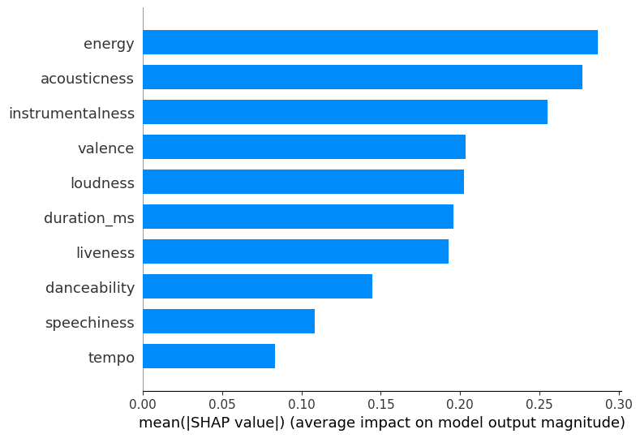
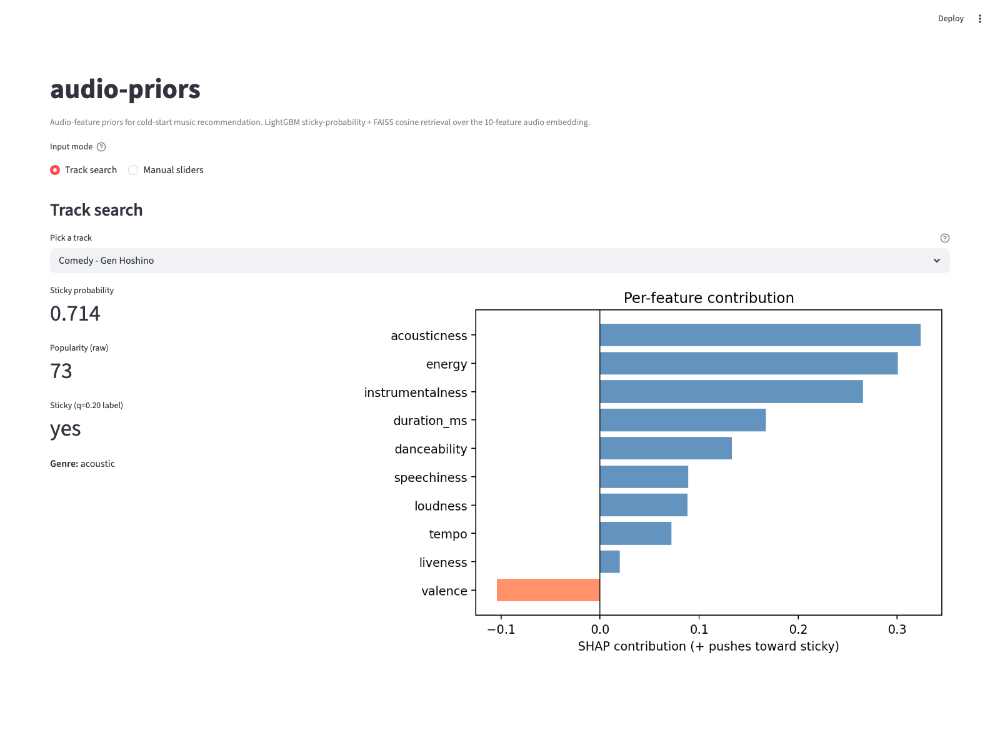

# audio-priors

Cold-start music recommendation from 10 Spotify audio features. When a fresh track lands with no genre tag and no listener history, how far does audio alone carry you?

**Headline:** a tuned LightGBM hits **ROC-AUC 0.711 (95% CI 0.702, 0.721)** on a 16,398-row hold-out, with isotonic-calibrated probabilities (Brier 0.205 to 0.150, a 27% relative cut). A FAISS retriever over the same features beats random Recall@10 by **11.6x** with non-overlapping CIs across 7,645 cold-start queries.

[](https://github.com/dhruvsood12/audio-priors/actions/workflows/ci.yml)
[](LICENSE)
[](pyproject.toml)

## Results

The audio-priors framing is the cold-start case: genre is unknown at inference time, audio is what you have. Numbers below are computed against the 16,398-row hold-out from the 81,987-row labeled subset (`sticky_top_q(q=0.20)`, realized positive rate 0.211, 80/20 stratified split, `random_state=42`). Bootstrap 1,000 resamples.

| Model | ROC-AUC | 95% CI | PR-AUC | F1\* | Brier |
|---|---|---|---|---|---|
| **lightgbm** (audio only) | **0.711** | **(0.702, 0.721)** | 0.394 | 0.442 | 0.202 |
| xgboost (audio only) | 0.708 | (0.699, 0.718) | 0.392 | 0.440 | 0.210 |
| random_forest (audio only) | 0.706 | (0.696, 0.715) | 0.390 | 0.434 | 0.151 |
| logistic (audio only) | 0.629 | (0.618, 0.639) | 0.299 | 0.384 | 0.237 |
| genre_prior (context, not audio) | 0.852 | (0.846, 0.859) | 0.610 | 0.586 | 0.118 |

\*F1 at the F1-maximizing threshold computed on the test set. This is an in-sample upper bound on F1, not a deployable threshold. See [MODEL.md](MODEL.md) for the fixed-threshold version and the [open issue tracker](https://github.com/dhruvsood12/audio-priors/issues) for the fix-in-progress.

A track is **sticky** if its Spotify popularity sits at or above the 80th percentile (top 20%) of the labeled corpus; the realized positive rate is 0.211 because of integer-popularity ties at the cutoff. The genre_prior row is the strong baseline you reach for when genre is *known*; the audio-only row is what you ship when it is not. The 14-point gap between them quantifies the value of categorical genre information beyond what audio summaries can recover.



## Why this matters

Streaming services need a recommendation signal for tracks that have no behavior history yet. Behavioral signals (skips, replays, saves) take days to weeks to accumulate; audio features are available from the first upload. This study quantifies how far they go on their own and where they break.

## What it does

Three pipelines build on a single 1.16-million-track corpus combining maharshipandya, rodolfofigueroa, and paradisejoy Kaggle datasets. The modeling pipeline (Phase 3) trains a five-model panel (genre prior, logistic, random forest, LightGBM, XGBoost) with bootstrap CIs. The interpretability pipeline (Phase 4) runs SHAP, permutation importance, logistic CIs, and isotonic recalibration; Brier improves from 0.205 to 0.150 after calibration, a 27% relative reduction. The recommender pipeline (Phase 5) builds a FAISS `IndexFlatIP` over L2-normalized audio features and beats random Recall@10 by **11.6x**.

## Reproduce

```bash
make install-dev      # editable install with dev, notebooks, app extras
make data             # Kaggle download + processed parquet (needs ~/.kaggle/kaggle.json)
make train            # train all five models, write outputs/tables/metrics.csv
make prepare-app      # bake model + FAISS artifacts to outputs/models/
make app              # launch the Streamlit demo on http://localhost:8501
```

No Kaggle account? `make data-demo` generates a 2K-row synthetic CSV in the same schema so the pipeline runs end-to-end without credentials.

Or with Docker:

```bash
docker compose up app    # builds the image, prepares artifacts, serves Streamlit
```

## Data

See [DATA.md](DATA.md) for the per-source attribution, license, fields used and dropped, and the Spotify Web API deprecation note. Three Kaggle datasets feed the corpus; raw CSVs are never committed.

## Methods

See [MODEL.md](MODEL.md) for the model card, including the intended use, top features across SHAP and permutation importance with the 2/3 overlap statement, calibration before and after isotonic, and the per-genre AUC.

## Per-genre AUC

LightGBM on the test set, top and bottom genres by audio predictability. Full table in [`outputs/tables/per_genre_auc.csv`](outputs/tables/per_genre_auc.csv).

| Genre | n | AUC |
|---|---|---|
| mpb | 150 | 0.97 |
| comedy | 183 | 0.96 |
| sleep | 148 | 0.93 |
| ... | ... | ... |
| breakbeat | 193 | 0.32 |
| study | 193 | 0.29 |

## Recommender results

Cold-start retrieval against `(same_genre OR same_artist) AND sticky` relevance on 7,645 evaluable queries from the 90/10 split. Bootstrap 1,000 resamples.

| Baseline | Recall@10 | NDCG@10 |
|---|---|---|
| audio_genre | 0.0186 | **0.2312** |
| genre_only | 0.0180 | 0.2249 |
| audio_only | 0.00147 | 0.0208 |
| popularity_only | 0.000394 | 0.00626 |
| random | 0.000127 | 0.00187 |

Audio-only KNN beats random by 11.6x on Recall@10 with non-overlapping CIs. Audio + genre beats genre-only on a paired-bootstrap NDCG@10 difference of +0.00632 (95% CI 0.00203, 0.01057), though the independent CIs overlap.

## Streamlit demo



Track-search mode picks a track and shows the sticky probability with per-feature SHAP contributions. Slider mode sets the ten audio features by hand and returns the top-10 nearest tracks by audio cosine. Boot is under 5 seconds with warm caches; each query returns in under one second.

## Limitations

- Popularity is a market signal, not a quality signal. It conflates artist reach, marketing spend, and timing.
- Audio features are Spotify-API heuristics computed before the November 2024 endpoint deprecation; the live API is not called.
- The 125-genre slice is uneven; per-genre AUCs at small n (under 50 test rows) are noisy.
- The cold-start ceiling at 0.71 AUC is what audio alone can do; behavioral signals (skips, replays) would dominate when available.

## Future work

- Add a second-stage learned projection that combines the genre prior with audio embeddings.
- Replace the 10-feature embedding with a deep audio model (MERT, CLAP) and see if the gap to the genre prior closes.
- Per-genre calibration: the global isotonic fit may understate or overstate confidence within specific buckets.
- A/B style offline eval against Last.fm play-count data once available.
- Creating V2 Soon!

## License and citation

MIT. See [LICENSE](LICENSE). The MIT license applies to code only; the three underlying Kaggle datasets retain their original licenses (ODbL-1.0, unknown, other; see [DATA.md](DATA.md)). The processed corpus is not redistributed by this project.

Cite as: Dhruv Sood, "audio-priors: cold-start audio-feature priors for music recommendation," v0.1.0, 2026.
