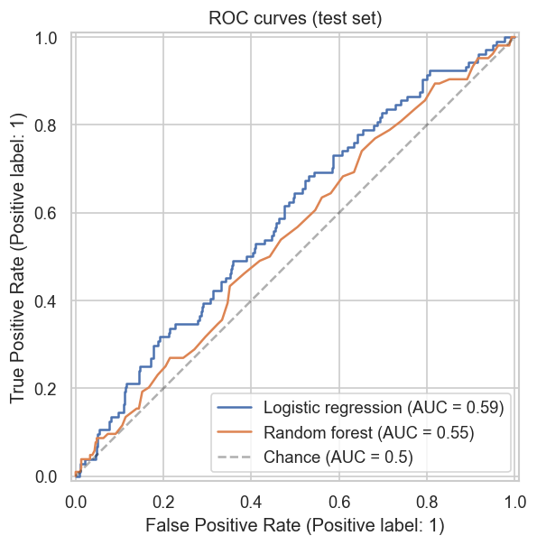

# SongAddiction

Can Spotify audio features predict whether a song "sticks"? Across 1545 real tracks from the 2020-2021 Spotify Top 200, the best model is a random forest predicting top-quintile popularity at ROC-AUC 0.594 (95% CI 0.508 to 0.674). Switching the target from popularity to chart-longevity does not lift AUC. Audio features alone are a thin signal.

## What it does

The pipeline cleans Spotify audio features, derives two binary stickiness targets (top-quintile of `popularity`, top-quintile of weeks on chart), and trains logistic regression and random forest classifiers to predict each from the same nine audio features. Outputs include bootstrap AUC confidence intervals, calibration curves, SHAP values, permutation importance, and per-genre AUC tables.

## Results

| target | model | ROC-AUC | 95% CI |
|---|---|---|---|
| sticky | majority class | 0.500 | -- |
| sticky | stratified random | 0.500 | -- |
| sticky | logistic regression | 0.558 | (0.472, 0.639) |
| sticky | random forest | 0.594 | (0.508, 0.674) |
| long_stayer | logistic regression | 0.544 | (0.469, 0.619) |
| long_stayer | random forest | 0.543 | (0.463, 0.618) |

Only the random forest on `sticky` clears chance by its bootstrap lower bound (0.508). Replacing the popularity target with a chart-longevity target did not raise AUC for either model. Numbers reproduce from `outputs/tables/target_comparison.csv` and `outputs/tables/model_metrics.csv`.

Per-genre AUC, logistic regression on `sticky`, test set: pop 0.579 (n=24), dance pop 0.572 (n=41), latin 0.159 (n=24). Latin's anti-predictive AUC is notable but rests on a small sample.

## How it works

Data comes from the [sashankpillai/spotify-top-200-charts-20202021](https://www.kaggle.com/datasets/sashankpillai/spotify-top-200-charts-20202021) Kaggle dataset: 1556 unique tracks pulled from the Spotify Top 200 between January 2020 and August 2021. `scripts/fetch_chart_data.py` downloads via the Kaggle CLI and reshapes the source's Title Case columns and list-shaped Genre field into the repo's canonical schema, including a `chart_weeks` column derived from "Number of Times Charted". `scripts/make_demo_data.py` produces a synthetic dataset with the same schema for users without Kaggle credentials.

Both targets are top-quintile binaries (80th percentile cutoff) of either `popularity` or `chart_weeks`. Features are the nine Spotify audio features that survive cleaning (danceability, energy, valence, tempo, loudness, speechiness, acousticness, liveness, duration_ms; instrumentalness is absent from this dataset). Logistic regression uses `StandardScaler` and `class_weight="balanced"`; random forest uses 200 trees with `class_weight="balanced"`. Evaluation is an 80/20 stratified split with `random_state=42`. AUCs include 1000-resample bootstrap 95% confidence intervals and are compared against majority-class and stratified-random baselines.

## Run it locally

Docker, demo data:

    docker compose up pipeline

This builds the image, generates a synthetic dataset, executes the three notebooks headless, and writes outputs to `./outputs/`.

Docker, real chart data:

    pip install kaggle
    # place credentials at ~/.kaggle/kaggle.json or ~/.kaggle/access_token
    python scripts/fetch_chart_data.py
    docker compose up pipeline

Local Python (development):

    pip install -e ".[dev]"
    pre-commit install
    pytest -q
    bash scripts/run_pipeline.sh

Requires Python 3.10 or higher. CI runs ruff, black, mypy, pytest, and a Docker pipeline check.

## Limitations

- Popularity and chart_weeks are both market signals; they reflect artist reach, marketing spend, and timing, not just track quality.
- The data is one snapshot of one chart (Top 200, 2020-2021); patterns may not generalize across markets or eras.
- Audio features are Spotify-API heuristics, not raw waveform analysis.
- Latin's per-genre AUC of 0.159 is based on 24 test tracks; the anti-predictive direction would need a larger sample to defend.
- Cold-start recommendation and skip-risk estimation are downstream applications this analysis does not attempt.

## References

- Dataset: [Spotify Top 200 Charts (2020-2021)](https://www.kaggle.com/datasets/sashankpillai/spotify-top-200-charts-20202021) on Kaggle.
- Modeling and metrics via [scikit-learn](https://scikit-learn.org/).
- SHAP: Lundberg, S. M. and Lee, S. (2017). "A Unified Approach to Interpreting Model Predictions." NeurIPS.
- Bootstrap CIs use `numpy.random.default_rng`; calibration via `sklearn.calibration.calibration_curve`.
